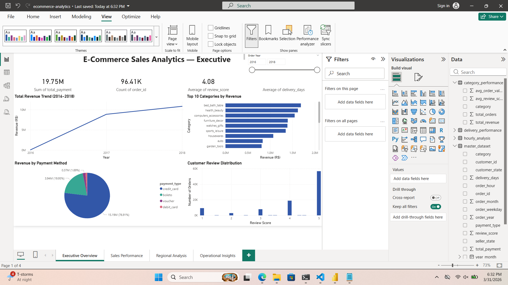
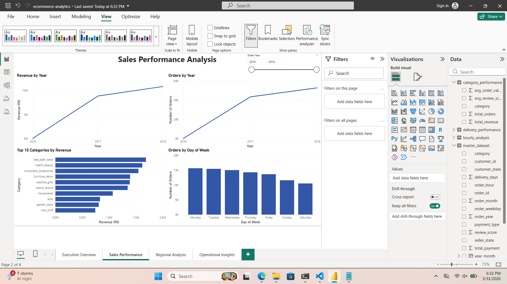
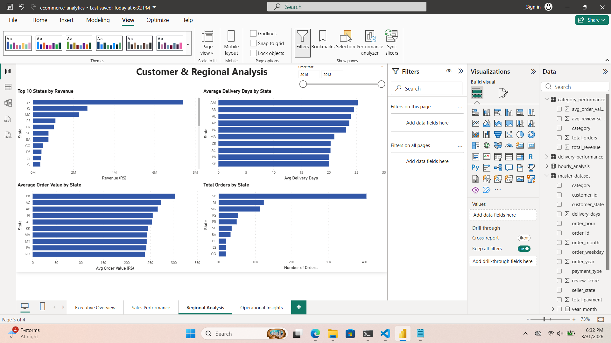
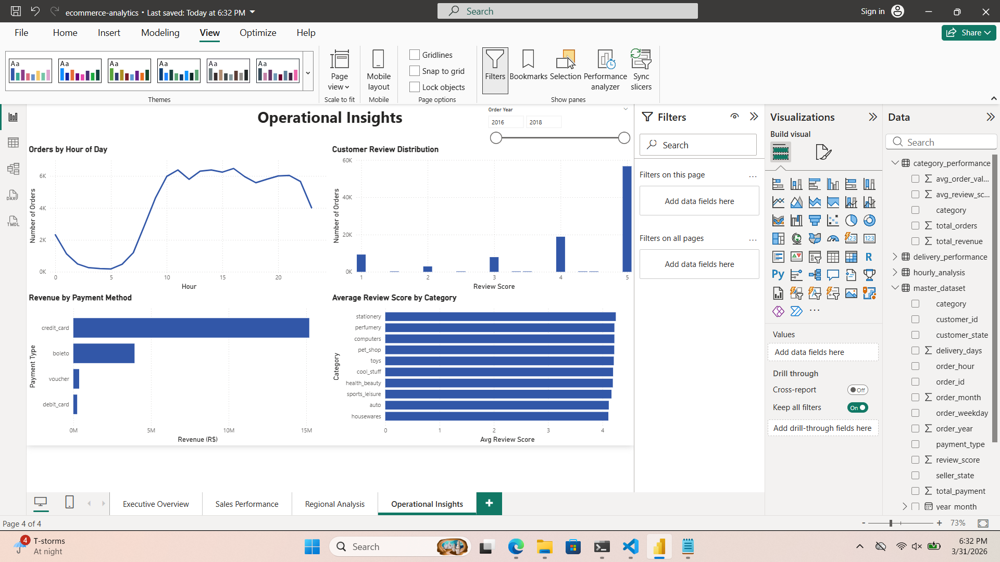

# E-Commerce Sales Analytics Dashboard

End-to-end data analytics project analyzing 110,000+ real Brazilian e-commerce 
transactions worth R$19.7 million using Python and Power BI.

## 📊 Dashboard Preview

### Executive Overview


### Sales Performance


### Regional Analysis


### Operational Insights


## 🔍 Key Business Insights
- **Total Revenue:** R$ 19.7 million across 96,413 orders
- **Top Category:** Bed & Bath Table generates highest revenue
- **Payment Method:** 74% of customers pay by credit card
- **Customer Satisfaction:** Average review score of 4.08/5
- **Delivery Performance:** Average delivery time of 11.9 days
- **Peak Shopping:** Most orders placed between 10AM - 4PM
- **Top State:** São Paulo (SP) generates highest revenue

## 🛠️ Tech Stack
- **Python** — data cleaning, merging, transformation
- **Pandas** — data manipulation and analysis
- **Power BI** — interactive dashboard with 4 pages
- **DAX** — calculated measures and KPIs

## 📁 Project Structure
```
ecommerce-analytics/
├── 01_data_cleaning.py          # Data pipeline script
├── master_dataset.csv           # Cleaned master dataset
├── monthly_revenue.csv          # Monthly revenue analysis
├── category_performance.csv     # Category analysis
├── state_performance.csv        # Regional analysis
├── payment_analysis.csv         # Payment methods
├── delivery_performance.csv     # Delivery analysis
├── weekday_analysis.csv         # Weekday patterns
├── hourly_analysis.csv          # Hourly patterns
├── review_distribution.csv      # Review scores
├── ecommerce_dashboard.pdf      # Dashboard export
└── ecommerce-analytics.pbix     # Power BI file
```

## 📋 Dashboard Pages
1. **Executive Overview** — KPI cards, revenue trend, top categories, payment methods
2. **Sales Performance** — Revenue and orders by year, category and weekday analysis
3. **Regional Analysis** — Top states by revenue, delivery days, order value
4. **Operational Insights** — Hourly orders, review distribution, payment analysis

## 🗃️ Dataset
**Brazilian E-Commerce Dataset by Olist** — available on Kaggle
- 99,441 orders from 2016-2018
- 7 interconnected datasets
- Real transaction data from Brazilian marketplace

## 💡 Business Questions Answered
1. Which product categories generate the most revenue?
2. How has revenue grown month over month?
3. Which states have the highest sales and fastest delivery?
4. What payment methods do customers prefer?
5. What time of day do most orders occur?
6. How satisfied are customers across different categories?